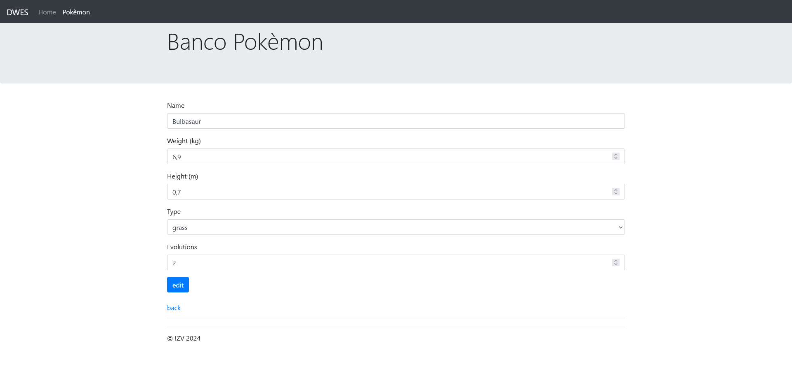

# CRUD en Laravel de una tabla de una base de datos
Aplicación de banco pokèmon

## Contenidos

[1. Creación del proyecto](#1-creación-del-proyecto)  
[2. .env](#2-env)  
[3. Controladores](#3-controladores)  
[4. Rutas](#4-rutas)  
[5. Vistas](#5-vistas)  
[6. Aspecto de la web](#6-aspecto-de-la-web)  

## 1. Creación del proyecto

En el directorio que albergará el proyecto:

    cd /var/www/html/laraveles/
    sudo composer create-project laravel/laravel bancoPokemon

A continuación se le dan los permisos necesarios al directorio padre para que no muestre errores al trabajar en él, en este caso, el directorio *laraveles*:

    cd /var/www/html
    sudo chown -R ubuntu:www-data laraveles/
    sudo chmod -R 775 laraveles/

Este proyecto se ha generado utilizando como referencia los archivos de un repositorio de github, por lo que se ha clonado en el directorio *laraveles*:

    cd laraveles/
    git clone https://github.com/dwesizv/traditionalLaravelApp.git

Nos desplazamos al directorio principal de nuestro proyecto:

    cd bancoPokemon/

Se verifican y se instalan todos los paquetes y dependencias necesarios ejecutando uno de los siguientes comandos de composer:

    composer install

    composer update

Por último, en phpMyAdmin, se ha creado la base de datos a utilizar junto con un usuario con todos los privilegios necesarios.

## 2. .env

Se ha de renombrar el archivo oculto *.env.example* que guarda las credenciales para conectar con la base de datos:

    mv .env.example .env

A continuación, con php artisan se genera la clave id para la aplicación. Este paso será 100% necesario si se trabaja con una app descargada de otro usuario.

    php artisan key:generate

Se edita el archivo .env para añadir db_connection, nombre de la base de datos, usuario y contraseña:

	DB_CONNECTION=mysql
    DB_HOST=127.0.0.1
    DB_PORT=3306
    DB_DATABASE=nombreBaseDatos
    DB_USERNAME=usuario
    DB_PASSWORD=contraseña

Una vez hecho esto, se hace una migración de la base de datos al directorio principal del proyecto de la siguiente manera:

    php artisan migrate

Finalmente, para dejar todo preparado, se ha copiado la carpeta *assets* del proyecto referente en el directorio *public* y se han creado dos nuevos directorios, *bank* y *main* dentro del directorio ya existente *resources/views*.

## 3. Controladores

Se ha comenzado creando un primer controlador que contenga login, logout y main:

    php artisan make:controller MainController

Contenido:

```php
<?php

namespace App\Http\Controllers;

use Illuminate\Http\Request;

class MainController extends Controller
{
    function login(Request $request) {
        $request->session()->flash('message', 'User logged in');
        $request->session()->put('user', true);
        return back();
    }

    function logout(Request $request) {
        $request->session()->flash('message', 'User logged out');
        $request->session()->forget('user');
        return back();
    }

    function main() {
        return view('main.main', ['lihome' => 'active']);
    }
}
```

Tras esto, se ha generado un segundo controlador para gestión, *PokemonController.php*, con las funciones create, destroy, edit, index, show, store y update.

## 4. Rutas

En *routes/web.php* se añaden las diferentes rutas que tendrá la aplicación:

```php
<?php

//package, import
use App\Http\Controllers\MainController;
use App\Http\Controllers\PokemonController;
use Illuminate\Support\Facades\Route;

//Defino las rutas
//1, página principal
Route::get('/', [MainController::class, 'main'])-> name('main');
//2, log in
Route::get('login', [MainController::class, 'login'])-> name('login');
//3, log out
Route::get('logout', [MainController::class, 'logout'])-> name('logout');
//4, 7 rutas (create, destroy, edit, index, show, store, update)
Route::resource('pokemon', PokemonController::class);
```

Después, de debe editar el archivo apache2.conf para asegurarnos de que queda de la siguiente forma:

    sudo nano /etc/apache2/apache2.conf

    <Directory /var/www/>
        AllowOverride All

Si el módulo de reescritura de rutas no estuviera habilitado, se debería ejecutar el comando `sudo a2enmod rewrite`.

Y por último, reiniciar el servicio de apache: `sudo service apache2 restart`.

Ahora podemos ver la lista de las rutas creadas con el comando `php artisan route:list` o su forma abreviada `abreviado: php artisan r:l`.

## 5. Vistas

En resources/views tenemos el directorio *main* que contiene la vista *main.blade.php*:

```php
@extends('base')

@section('title', 'Pokèmon, peso, altura, tipo y número de evoluciones')

@section('content')

    @if(session('user'))
        <a href="{{url('logout')}}" class="btn btn-success">log out</a>
    @else
        <a href="{{url('login')}}" class="btn btn-success">log in</a>
    @endif
    &nbsp;
    <a href="{{url('pokemon')}}" class="btn btn-success">banco</a>

@endsection
```

Seguidamente, teniendo la misma ruta raíz que el directorio anterior, está el directorio *bank*, que contiene todas las vistas para que la aplicación pueda ofrecer al usuario una correcta gestión de los datos:

- *base.blade.php*
- *create.blade.php*
- *edit.blade.php*
- *index.blade.php*
- *show.blade.php*

### Javascript

Para el borrado de datos en *index.blade.php* mediante un enlace y un formulario, en vez de un botón, se ha utilizado un script javascript que controlará el evento de selección de la opción de eliminación y ofrecerá una confirmación de borrado.

En public/assets/scripts/script.js:

```javascript
(function () {

    let tabla = document.getElementById('tablaPokemon');

    if(tabla) {
        tabla.addEventListener('click', clickTable);
    }

    function clickTable(event) {
        const formDelete = document.getElementById('formDelete');
        let target = event.target;
        if(target.tagName === 'A' && target.getAttribute('class') === 'borrar') {
            event.preventDefault();
            if(confirm('Confirm delete?')) {
                let url = target.dataset.href;
                formDelete.action = url;
                formDelete.submit();
            }
        }
    }

})();
```

## 6. Aspecto de la web

El aspecto de esta web es el mismo que en la versión de php, exceptuando el mensaje de login, como se puede ver a continuación:


<br>


<br>


<br>


<br>


<br>



<br>

